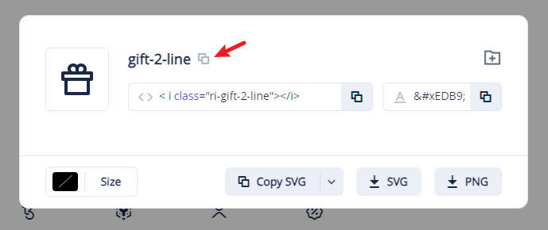

# 更新说明
大概记录一下功能性更新，修复BUG不在此记录

### v0.6.4 更新
新增：支持网络监控折线图拆分单一图表功能；  
新增：公开备注中设定节点的flag，自定义国家/地区旗帜；  
新增：支持地图在首页与详情页的上下位置切换；  

### v0.5.7 更新
新增：添加自定义favicon支持；  

### v0.5.4 更新
新增：新增内置搜索，支持`Ctrl+K`快速打开搜索；  

### v0.5.3 更新
新增：支持单独给服务器设置购买按钮的文案和图标，需要在公开备注的customData中添加`buyBtnText`和`buyBtnIcon`字段。  
> 使用方法：`buyBtnText`用于设置购买按钮的文案，`buyBtnIcon`用于设置购买按钮的图标，图标支持Remixicon的图标名称，例如：`ri-gift-2-line`。  
> 示例：点击复制图标名称，然后填写到`buyBtnIcon`字段中，补齐`ri-`前缀即可。  
> 
> 在线图标网站：[www.remixicon.com](https://www.remixicon.com/) 目前支持版本为4.6.0
