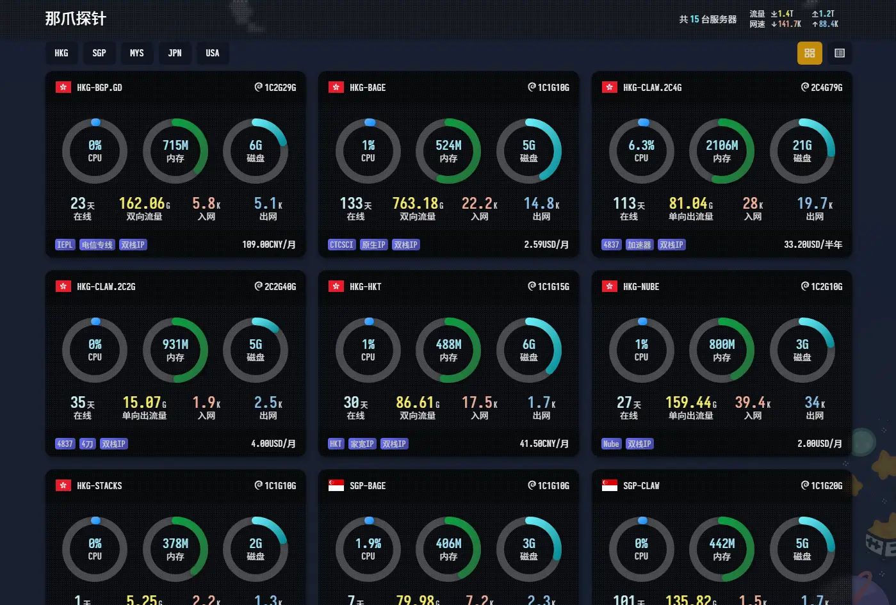
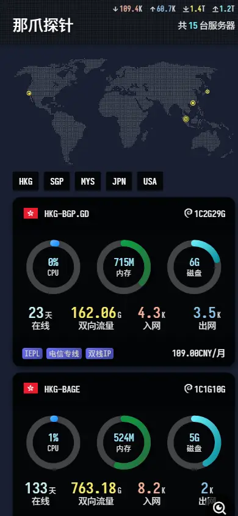

# Nazhua
<div align="center">
  
  
</div>


**使用前，请务必阅读Readme的内容，对你有帮助**  
> 基于哪吒监控(nezha.wiki)v0版本构建的前端主题，目前兼容与v0相同数据结构的v1版本。  
> ~~主题有点**重**，因为内置了一个带中文的`SarasaTermSC-SemiBold`字体。~~  
> ~~根据不同场景，可以选择是否打包带入或者是否加载这个字体。~~   
> 考虑到多数国内直连用户无法访问jsdelivr，所以默认使用cdnjs的loli.net引用版本。  
> 同时默认关闭SarasaTermSC字体，如果需要使用，请使用Docker镜像全量包。  

## 部署
推荐使用Docker Compose进行部署Nazhua  
[参考文档](./doc/deploy.md)  
nazhua提供了很多细节配置，包括点阵地图显示/隐藏、首页风格的切换等功能；  
如果你是使用v1内置版本，可以直接通过[配置生成器](https://hi2shark.github.io/nazhua-generator/)生成配置文件，然后填写在控制台的自定义代码中；  
如果你是使用docker部署（包括v0版本），则需要手动配置`config.js`，具体参考文档说明；  


## 公开备注
涉及到地图上节点位置的显示，需要在公开备注中指定`location`字段，具体参考公开备注的说明文档  
[参考文档](./doc/public-note.md)  

## 更新
[功能更新日志](./doc/update.md)  

## 赞助
> 按服务商字母排序，不分先后。
<table>
  <tr>
    <td align="center">
      <a href="https://www.vmiss.com" target="_blank" title="VMISS，加拿大企业，打造全球优质优化线路。提供香港、日本、韩国、美国、英国的云服务器">
        
      </a>
      <br />
      <span style="font-weight: bold;">VMISS</span>
    </td>
    <td align="center">
      <a href="https://yxvm.com" target="_blank" title="YXVM，提供香港、新加坡、日本的云服务器与物理服务器">
        
      </a>
      <br />
      <span style="font-weight: bold;">YXVM</span>
    </td>
  </tr>
</table>  

## 二次开发提示
`.env.development.local`配置变量
```bash
#### Sarasa Term SC字体的配置
# VITE_DISABLE_SARASA_TERM_SC=1
# VITE_SARASA_TERM_SC_USE_CDN=1

#### 引用库的CDN配置
# VITE_USE_CDN=1
# VITE_CDN_LIB_TYPE=jsdelivr # jsdelivr | cdnjs | loli

#### 哪吒的默认版本控制
# VITE_NEZHA_VERSION=v1 # v0 | v0

#### 本地开发设置
# PROXY_WS_HOST= # 本地开发时，可以代理WS服务的地址，启用后，自动转发至 {PROXY_WS_HOST}/proxy?wsPath={WS_HOST}
# API_HOST= # 本地开发时，代理的API服务地址
# WS_HOST= # 本地开发时，代理的WS服务地址
##### 仅限v0版本
# NEZHA_HOST= # 本地开发时，代理的哪吒主页地址
```

## 数据来源（参考）
1-v0. 公开的全量配置，其中包括“公开备注”（PublicNote），来自探针主页上暴露的服务器节点列表配置信息。此处是根据正则匹配的方式，获取到的节点列表。在主题项目中，默认将访问`/nezha/`的指向此处。  
2-v0. 实时数据，v0来自公开的ws服务接口，`/ws`。  
2-v1. 实时数据/全量数据，v1来自公开的ws服务接口，`/api/v1/ws/server`。  
3-v0. 监控数据，v0来自公开的api接口，`/api/v1/monitor/${id}`。  
3-v1. 监控数据，v1来自公开的api接口，`/api/v1/service/${id}`。  
4-v0. 分组数据，v0来自服务器节点列表的`Tag`字段匹配。  
4-v1. 分组数据，v1来自公开的api接口，`/api/v1/server-group`。  
