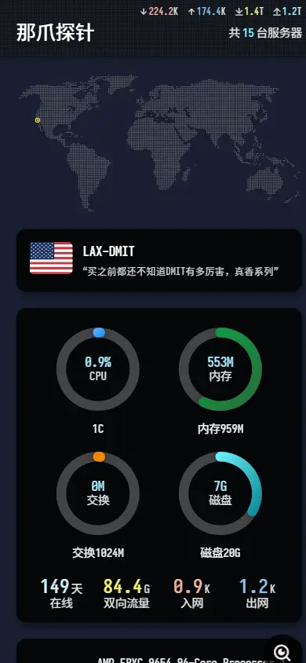

# Nazhua

<div>
  
  
  
</div>

## 📢 使用须知

**使用前，请务必阅读本文档，对您的部署会有很大帮助**

- 基于哪吒监控(nezha.wiki)v0版本构建的前端主题，兼容v1版本数据结构
- 考虑到国内用户访问需求，默认使用cdnjs的loli.net作为CDN引用源
- 如需使用SarasaTermSC字体，请选择Docker镜像全量包进行部署

## 🚀 部署指南

**推荐使用Docker Compose + Cloudflare Tunnels部署Nazhua**

👉 [详细部署文档](./doc/deploy.md)

Nazhua提供了丰富的配置选项：
- 支持点阵地图显示/隐藏
- 首页风格切换等多种个性化设置

配置方式：
- **V1内置版本**：使用[配置生成器](https://hi2shark.github.io/nazhua-generator/)生成配置，填入控制台自定义代码
- **Docker部署**：手动配置`config.js`文件（包括v0版本）

## 🗺️ 节点位置配置

要在地图上显示节点位置，需在公开备注中指定`location`字段

👉 [公开备注配置文档](./doc/public-note.md)

## 📝 更新日志

👉 [功能更新记录](./doc/update.md)

## 🤝 赞助商

> 按服务商字母排序，不分先后

<table>
  <tr>
    <td align="center">
      <a href="https://www.vmiss.com" target="_blank" title="VMISS，加拿大企业，打造全球优质优化线路。提供香港、日本、韩国、美国、英国的云服务器">
        
      </a>
      <br />
      <strong>VMISS</strong>
    </td>
    <td align="center">
      <a href="https://yxvm.com" target="_blank" title="YXVM，提供香港、新加坡、日本的云服务器与物理服务器">
        
      </a>
      <br />
      <strong>YXVM</strong>
    </td>
  </tr>
</table>

## 💻 开发者指南

### 环境配置

在`.env.development.local`中配置以下变量：

```bash
#### Sarasa Term SC字体设置
# VITE_DISABLE_SARASA_TERM_SC=1
# VITE_SARASA_TERM_SC_USE_CDN=1

#### CDN配置
# VITE_USE_CDN=1
# VITE_CDN_LIB_TYPE=jsdelivr # jsdelivr | cdnjs | loli

#### 哪吒版本控制
# VITE_NEZHA_VERSION=v1 # v0 | v1

#### 本地开发设置
# PROXY_WS_HOST= # 本地开发时，可以代理WS服务的地址，启用后，自动转发至 {PROXY_WS_HOST}/proxy?wsPath={WS_HOST}
# API_HOST= # 本地开发时，代理的API服务地址
# WS_HOST= # 本地开发时，代理的WS服务地址
##### 仅限v0版本
# NEZHA_HOST= # 本地开发时，代理的哪吒主页地址
```

### 数据来源参考

| 数据类型 | V0版本 | V1版本 |
|---------|--------|--------|
| 全量配置 | 公开备注(PublicNote)：通过正则匹配节点列表，默认访问`/nezha/` | - |
| 实时数据 | WS接口：`/ws` | WS接口：`/api/v1/ws/server` |
| 监控数据 | API接口：`/api/v1/monitor/${id}` | API接口：`/api/v1/service/${id}` |
| 分组数据 | 服务器节点列表的`Tag`字段匹配 | API接口：`/api/v1/server-group` |
