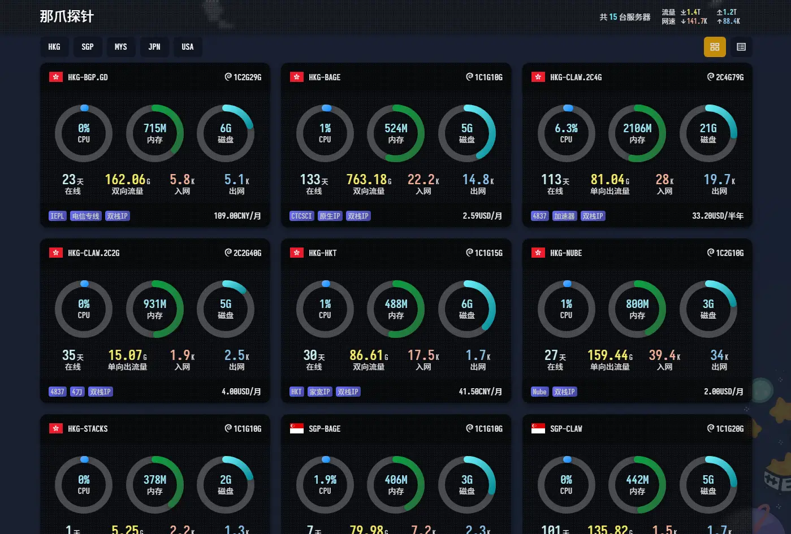
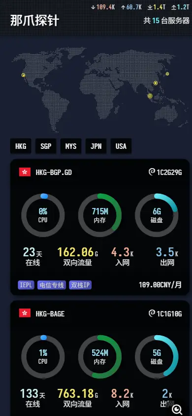
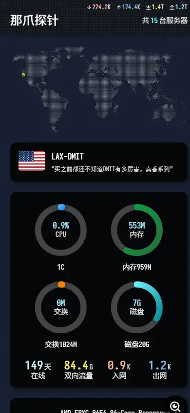

# Nazhua

Nazhua 是一个为 [哪吒监控](https://nezha.wiki/) 设计的纯前端展示主题，默认基于哪吒 v0 数据源构建，同时兼容哪吒 v1 数据结构。项目适合部署在静态 Web 服务或 Docker 容器中，通过反向代理读取哪吒面板数据、WebSocket 和监控接口。

<div>
  
  
  
</div>

## 特性

- 支持哪吒 v0 / v1 数据结构。
- 支持卡片、列表、ServerStatus 风格三种首页列表模式。
- 支持首页列表周期流量摘要与详情页周期流量卡片。
- 支持点阵世界地图、节点详情页、监控图表、服务器统计与实时数据。
- 支持公开备注扩展：账单、套餐、位置、旗帜、购买链接、节点标语等。
- 支持内置搜索、分组筛选、在线状态筛选、排序、列表模式切换。
- 支持 `config.js` 运行时配置与 `style.css` 自定义样式。
- 支持 Docker、静态 Web 服务、CDN 依赖版本等部署方式。

## 使用前须知

- Nazhua 只是前端主题，不包含哪吒 Dashboard 或 Agent。
- 国内访问场景默认倾向使用 loli.net CDN 源；如需完整字体资源，优先使用全量 Docker 镜像。
- v0 部署通常需要代理 `/nezha/`、`/ws`、`/api/v1/monitor/{id}`。
- 如需启用周期流量展示，v0 还需保证服务页可通过 `nezhaPath/service` 访问。
- v0 的周期流量兼容按节点名称匹配服务页表格；若存在重名节点，展示结果为 best-effort。
- v1 部署通常需要代理 `/api` 与 `/api/v1/ws/server`。
- H5 路由模式需要 Web 服务将普通页面路径回退到 `index.html`，但静态资源路径应保留真实 404。

## 快速开始

推荐使用 Docker Compose 部署：

```yaml
services:
  nazhua:
    image: ghcr.io/hi2shark/nazhua:latest
    container_name: nazhua
    ports:
      - 80:80
    environment:
      - DOMAIN=_
      - NEZHA=http://nezha-dashboard.example.com/
    volumes:
      # - ./config.js:/home/wwwroot/html/config.js:ro
      # - ./style.css:/home/wwwroot/html/style.css:ro
      # - ./favicon.ico:/home/wwwroot/html/favicon.ico:ro
    restart: unless-stopped
```

更多部署方式见 [部署指南](./doc/deploy.md)。

## 配置入口

建议使用 [Nazhua 配置生成器](https://hi2shark.github.io/nazhua-generator/) 生成 `config.js` 或公开备注内容。

常用配置文件：

| 文件 | 用途 |
| --- | --- |
| `config.js` | 运行时配置，例如标题、列表模式、地图、接口路径、路由模式 |
| `style.css` | 自定义样式，例如背景图、主题色、局部样式覆盖 |
| `favicon.ico` | 自定义站点图标 |

配置方式：

- Docker / 静态部署：挂载或上传 `config.js`、`style.css`。
- v1 内置版本：使用配置生成器生成内容，填入哪吒控制台自定义代码。
- v0 同域子目录部署：可参考 `build:nazhua` 构建脚本与部署文档。
- 首页列表周期流量摘要可通过 `hideListItemCycleTransfer`、`listCycleTransferRefreshTime` 控制；`ServerStatus` 默认列已包含周期流量，自定义 `serverStatusColumnsTpl` 时请保留 `cycleTransfer`。

## 公开备注

Nazhua 支持 ServerStatus 公开备注字段，并扩展了地图、旗帜、购买链接等展示能力。最常用的是在公开备注中配置节点位置：

```json
{
  "customData": {
    "location": "HKG"
  }
}
```

完整字段与示例见 [公开备注配置指南](./doc/public-note.md)。

## 数据来源

| 数据类型 | v0 | v1 |
| --- | --- | --- |
| 全量配置 | 从 `/nezha/` 页面解析服务器列表与 `PublicNote` | WebSocket / API 数据转换 |
| 实时数据 | `/ws` | `/api/v1/ws/server` |
| 监控数据 | `/api/v1/monitor/{id}` | `/api/v1/server/{id}/service`（兼容 `/api/v1/service/{id}`） |
| 周期流量 | `/service` 页面解析 | `/api/v1/service` |
| 分组数据 | 服务器 `Tag` 字段 | `/api/v1/server-group` |
| 站点配置 | 公开备注和运行时配置 | `/api/v1/setting` |

## 本地开发

安装依赖后启动开发服务：

```bash
npm install
npm run dev
```

常用脚本：

| 命令 | 说明 |
| --- | --- |
| `npm run dev` | 启动 Vite 开发服务 |
| `npm run build` | 构建默认版本 |
| `npm run build:cdn` | 构建 CDN 依赖版本 |
| `npm run build:nazhua` | 构建 v0 同域 `/nazhua/` 子目录版本 |
| `npm run lint` | 运行 ESLint |

开发环境可在 `.env.development.local` 中配置代理与构建选项：

```bash
# 字体与 CDN
# VITE_DISABLE_SARASA_TERM_SC=1
# VITE_SARASA_TERM_SC_USE_CDN=1
# VITE_USE_CDN=1
# VITE_CDN_LIB_TYPE=jsdelivr # jsdelivr | cdnjs | loli

# 哪吒版本
# VITE_NEZHA_VERSION=v1 # v0 | v1

# 本地代理
# API_HOST=
# WS_HOST=
# PROXY_WS_HOST=

# v0 专用
# NEZHA_HOST=
```

## 文档

- [部署指南](./doc/deploy.md)
- [公开备注配置指南](./doc/public-note.md)
- [更新日志](./doc/update.md)

## 赞助商

<table>
  <tr>
    <td align="center">
      <a href="https://www.vmiss.com" target="_blank" title="VMISS，加拿大企业，打造全球优质优化线路。提供香港、日本、韩国、美国、英国的云服务器">
        
      </a>
      <br />
      <strong>VMISS</strong>
    </td>
  </tr>
</table>

## 相关链接

- 项目仓库：[https://github.com/hi2shark/nazhua](https://github.com/hi2shark/nazhua)
- 配置生成器：[https://hi2shark.github.io/nazhua-generator/](https://hi2shark.github.io/nazhua-generator/)
- 哪吒监控文档：[https://nezha.wiki/](https://nezha.wiki/)
